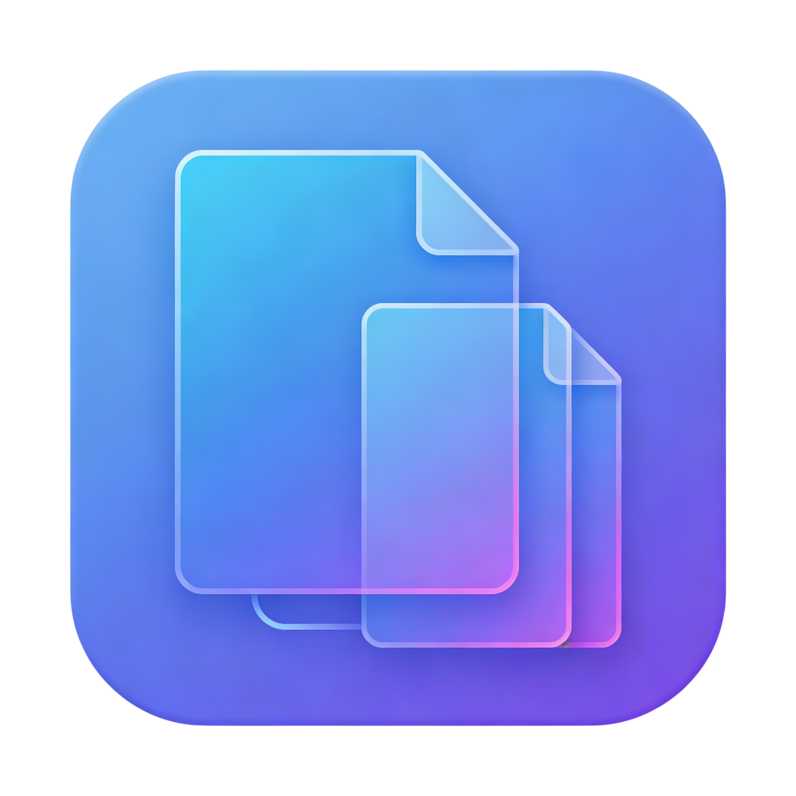
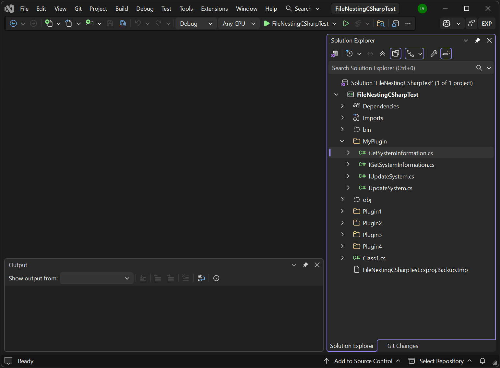

<p align="center">
  
</p>

# Nestify

A Visual Studio extension that brings smart file nesting to Solution Explorer. Nest, unnest, and auto-nest files based on naming conventions — keeping your projects tidy and navigable. Supports Community, Professional, and Enterprise editions.

<p align="center">
  
</p>

## Features

- **Nest Files** — Manually nest selected files under a parent file using a picker dialog (files must be siblings in the same folder).
- **Unnest Files** — Remove nesting and restore files to the top level. Only files that are actually nested are touched.
- **Auto-Nest** — Automatically detect parent–child relationships using built-in rules:
  - C# implementations nest under their interfaces (`UserService.cs` → `IUserService.cs`)
  - Minified/bundled JS files nest under their source (`app.min.js` → `app.js`, `app.bundle.js` → `app.js`, `app.bundle.min.js` → `app.bundle.js`)
  - Markdown documentation nests under the matching code file (`UserService.md` → `UserService.cs`; also `.vb`, `.ts`, `.tsx`, `.js`, `.jsx`)

Nesting never changes a file's build action or other item metadata, and Solution Explorer reflects changes immediately — no project reload needed.

## Supported File Types

`.cs` `.vb` `.fs` `.js` `.jsx` `.ts` `.tsx` `.mjs` `.mts` `.cjs` `.cts` `.vue` `.css` `.scss` `.less` `.html` `.htm` `.json` `.xml` `.config` `.resx` `.xaml` `.razor` `.cshtml` `.md`

## Requirements

| Requirement    | Version                                      |
| -------------- | -------------------------------------------- |
| Visual Studio  | 2022 or later (17.0+) Community, Professional, or Enterprise — amd64 and arm64 |
| .NET Framework | 4.7.2                                        |

## Installation

Download and install the Nestify extension from the latest release.

## Usage

1. Right-click one or more files in **Solution Explorer**.
2. Choose one of the Nestify commands from the context menu:
   - **Nestify: Nest under...** — pick a parent file from the dialog.
   - **Nestify: Unnest** — remove the nesting relationship.
   - **Nestify: Auto-nest** — let Nestify find parents automatically based on naming rules.

To use Auto-nest, first enable it once via **Nestify: Enable Auto-nest** in the project node's context menu — the Auto-nest command then appears on project, folder, and file nodes.

## Contributing

Contributions are welcome! Please read the [Contributing Guide](CONTRIBUTING.md) before submitting a pull request.

## Project Structure

| Project | Description |
| --- | --- |
| `Nestify` | Visual Studio extension (VSIX) — targets .NET Framework 4.7.2 |
| `Nestify.Tests` | Unit tests (MSTest) — targets .NET Framework 4.7.2 |

Run the tests with:

```bash
dotnet test Nestify.Tests\Nestify.Tests.csproj
```

## Code of Conduct

This project follows the [Contributor Covenant Code of Conduct](CODE_OF_CONDUCT.md). By participating, you are expected to uphold this code.

## Security

To report a vulnerability, please see [SECURITY.md](SECURITY.md).

## Support

Need help? Check out [SUPPORT.md](SUPPORT.md) for available resources.

## License

This project is licensed under the [MIT License](LICENSE).

## Sponsor

If you find Nestify useful, consider supporting its development:

<a href="https://github.com/sponsors/Root18" target="_blank">
  
</a>

<a href="https://www.buymeacoffee.com/iroot18" target="_blank">
  
</a>
